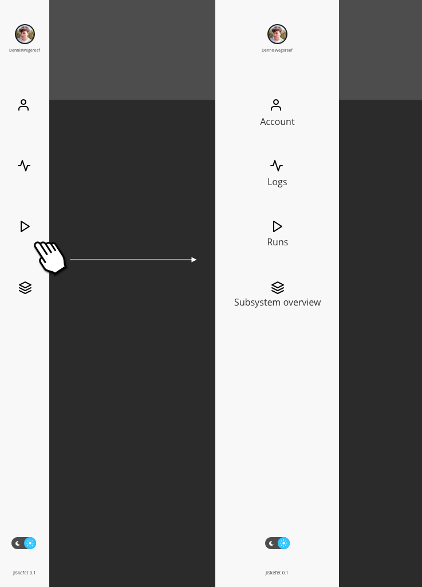

# Jiskefet

Live example: [https://jiskefet.netlify.com/](https://jiskefet.netlify.com/)

## Intro

We are working together (Tim en Dennis) to try out a various amount of things.
Mostly we try to improve the user experience and add a extra feature to the page.

Firstly we had to rebuild some of it, we use a combination of bootstrap and our own styling to quickly prototype.
The base is [react bootstrap](https://react-bootstrap.github.io/).

## Overal

- We still stick with the sidebar, but a smaller version. When you hover over it it should expand and show the text, so users don't have to guess the icons.

- Also a light and dark theme switch, it is always good to let people decide whatever they prefer. Black text on a white background is easier to read when there is much light. But when it's late the white background is harder to read for a longer period for your eyes, that's when darkmode comes in if people want to use it.

- It is important that you need to keep it consistent, so people know where everything is and nothing should be really suprising.

- When multiple users work with the same app, they should get a notifiction when someone comments or create's a new log. (there should also be a option to disable it, personal preference).

Menu hover gesture

### Logs page

- The first thing we noticed is the fact that pages could be merged together. To create a log it's more efficient to have it on the logs page. With a sticky header always accessible wherever you are.

- We wanna give the people that use the logs page a simple switch between cards and a table layouy. A easy implementation and people can choose whatever they want and prefer to read it more easy.

- To use a progressive disclosure for the filter items it should not always be visible only the button in the top header. When you expand it it transistions over the cards or table without changing the layout. We prefer to use a full width filter expandable menu so users don't need to scroll when more filters possible are added.

#### Create a a log page

- Within the log page you could easy create a log, it creates a new screen on top of the current logs where you are.

- It should also be possible to directly add comments and link runs, when you create it.

### Runs page

We used it a little and it feels like a total drop of data. With a large table with lot's of variables. But we thought what if users wanne compare certain runs. With the current web app it's not possible.

- A compare system where you can select a certain amount of runs, push on the compare button and zone the individuals out to make it easy to compare. So people don't have to write the individual numbers down

- Also a more stable layout for the filters also mentioned in the logs page. With a sticky header so when people the filters will always be there for them.

- When you add a run, there should be a little feedback to show that the 'compare basket' got a new item. Could be as easy as a small little bump, color change. So people know the web app is responding to their actions.

# Subsystem overview

- Currently not much to say about it
